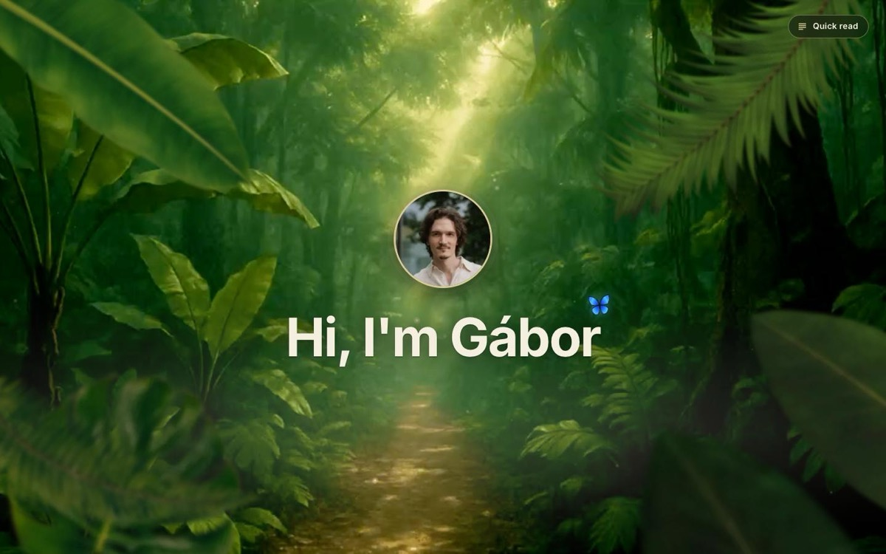
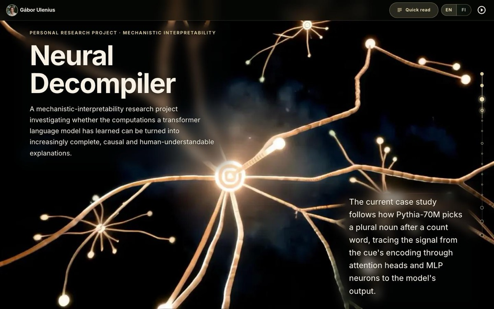
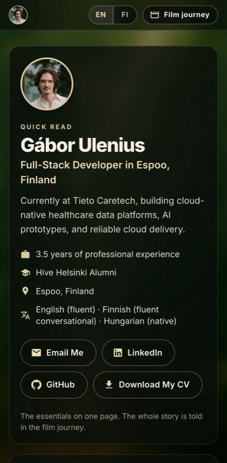

# Gábor Ulenius — portfolio

The portfolio of Gábor Ulenius, Full-Stack Developer in Espoo, Finland: one
scroll-driven journey through five films, with the real content — semantic
HTML, in English and Finnish — held still over them.

**Live:** [mobahug.github.io/gaborulenius](https://mobahug.github.io/gaborulenius/)
· **Quick read**, the essentials on one calm page:
[`?read`](https://mobahug.github.io/gaborulenius/?read)
· **Suomeksi:** [`?lang=fi`](https://mobahug.github.io/gaborulenius/?lang=fi)

<p>
  
  
</p>

## How it works

- **Scroll is the only clock.** Every picture is a pure function of the
  scroll position (`src/journey/film/filmTimeline.ts`): scrolling back plays
  everything backwards, and a link or a reload lands in exactly the state
  slow scrolling would reach.
- **Five films, joined where the footage allows it** — a pupil that becomes
  a window into the next film, white into cream, black into black, a leaf
  onto a leaf. What each film contains and why each seam is where it is:
  [docs/cinematic-audit.md](docs/cinematic-audit.md).
- **Scrubbing video smoothly.** The films are re-encoded for seeking (a
  keyframe every 4–8 frames, no B-frames, fast start), with portrait crops
  for phones that follow each film's subject: a third of the pixels, as
  sharp as full HD. Phone decoders seek slowly, so there the film _plays_
  at the scroll's speed going forward and seeks only backwards.
- **Content that holds still.** Each block fades in part by part, holds
  while the film plays behind it and fades out, over a veil (a backdrop
  blur shaded by the footage's measured brightness) that keeps the words
  readable.
- **Quick read.** For a visitor who wants the facts first, one switch
  leads to a summary on a single calm page — who, the developer years,
  the work, the key skills and the ways to get in touch — over a still,
  out-of-focus picture of the jungle; no video is downloaded.
- **Sound, if asked for.** Each scene has its own — the jungle, a space
  score, the Okavango above and under the water, an office — at the same
  loudness. A scene's sound fades in once the visitor has stayed on it
  for half a second and fades out when they move on or scroll fast, so
  skimming stays quiet. Nothing loads until the sound is turned on.
- **Reduced motion.** A system that asks for it gets the journey with
  each film's still behind its content and nothing held.
- **Fast first paint.** The cover is plain DOM, painted before React, MUI
  and the copy have loaded; the rest arrives around the visitor (about
  210 KB of JavaScript, gzipped).

Design and implementation notes: [docs/scrollcraft-journey.md](docs/scrollcraft-journey.md).



## Stack

React 19 · TypeScript · Vite · MUI · Jotai · react-intl · Vitest ·
Playwright · GitHub Actions and Pages. The films are encoded with
AVFoundation (`tools/film`), the cover's leaves are rendered and graded
offline (`tools/leaves`), the sounds are encoded and levelled with
afconvert (`tools/audio`), and the share card and icons are drawn by
`tools/social/render.mjs`.

## Running it

```bash
npm ci
npm run dev          # http://localhost:5173/gaborulenius/
npm test             # unit tests (Vitest)
npm run build
npm run test:e2e     # browser smoke tests of the build (Google Chrome)
npm run lint         # ESLint, including jsx-a11y
```

Useful addresses: `?read` (quick read), `?lang=fi` (Finnish),
`?debug=film` (how the film on screen is doing, on the device itself).

| Path              | What                                                           |
| ----------------- | -------------------------------------------------------------- |
| `src/journey/`    | the scroll clock, the director, the films, stages and overlays |
| `src/components/` | the cover, the navigation, sections                            |
| `src/i18n/`       | the English and Finnish copy                                   |
| `e2e/`            | Playwright smoke tests                                         |
| `tools/`          | offline pipelines: films, sounds, leaves, share card and icons |
| `docs/`           | design notes                                                   |

## Deployment

Every push to `main` runs CI — lint, formatting, unit tests, the build and
the browser tests — and deploys `dist/` to GitHub Pages; Lighthouse reports
on each run. Once a week a job checks that every outside link still
answers.

## License

© Gábor Ulenius. All rights reserved. The sounds of the neural network, the
Explorer and the work are from Pixabay, under the
[Pixabay Content License](https://pixabay.com/service/license-summary/):
[Space Cinematic Music](https://pixabay.com/music/adventure-space-cinematic-music-414649/)
by Tunetank,
[Birds in Wetland](https://pixabay.com/sound-effects/nature-birds-in-wetland-16740/),
[Underwater Ambience](https://pixabay.com/sound-effects/nature-underwater-ambience-376890/),
[Office ambience](https://pixabay.com/sound-effects/technology-office-ambience-24734/).
